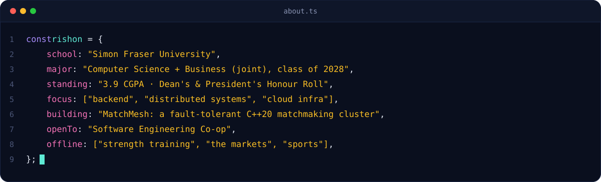
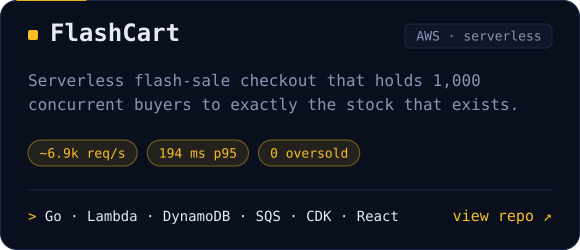
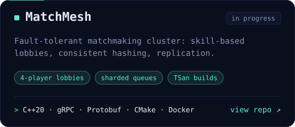
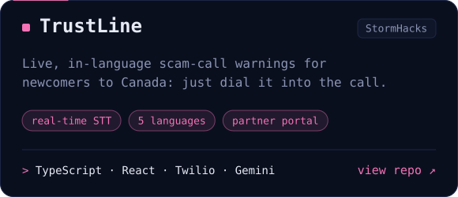
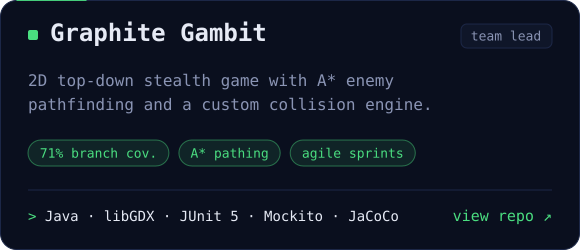
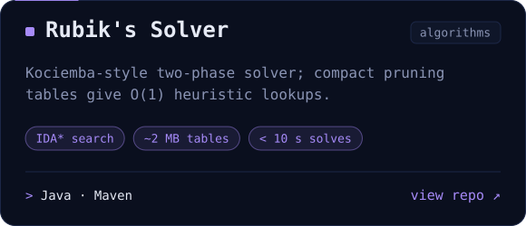
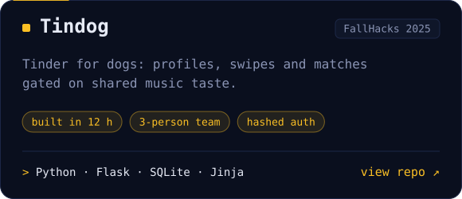
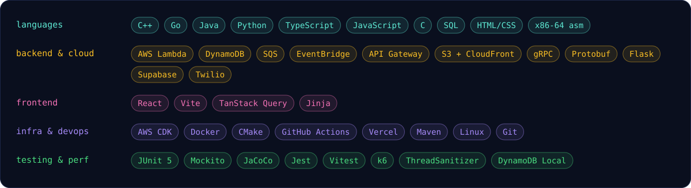

  

  &nbsp;
  &nbsp;
  

 

<picture>
  <source media="(prefers-color-scheme: light)" srcset="assets/section-about-light.svg" />
  
</picture>

  

 

<picture>
  <source media="(prefers-color-scheme: light)" srcset="assets/section-projects-light.svg" />
  
</picture>

  
  

  
  

  
  

 

<picture>
  <source media="(prefers-color-scheme: light)" srcset="assets/section-stack-light.svg" />
  
</picture>

  

 

<picture>
  <source media="(prefers-color-scheme: light)" srcset="assets/section-contact-light.svg" />
  
</picture>

  Open to co-op roles, systems-design chats and project collaborations. 
  <b><a href="mailto:rishonghosh@icloud.com">rishonghosh@icloud.com</a></b> &nbsp;·&nbsp; <b><a href="https://www.linkedin.com/in/rishon-ghosh/">LinkedIn</a></b> &nbsp;·&nbsp; <b><a href="resume.pdf">Resume</a></b> 
  The resume is compiled from its <a href="resume.tex">LaTeX source</a> by GitHub Actions on every change.

  <picture>
    <source media="(prefers-color-scheme: light)" srcset="assets/footer-light.svg" />
    
  </picture>

